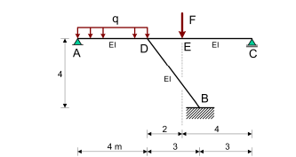

# Oefenen

Nu gaan we aan de slag met een oefening.

````{margin}
```{attributiongrey} Attribution
:class: attribution

Deze oefeningen is aangepast van  https://github.com/TUDelft-books/CT1000 versie CTB2210-2025.
```
````
## Oefening 1

Gegeven is de volgende constructie:


